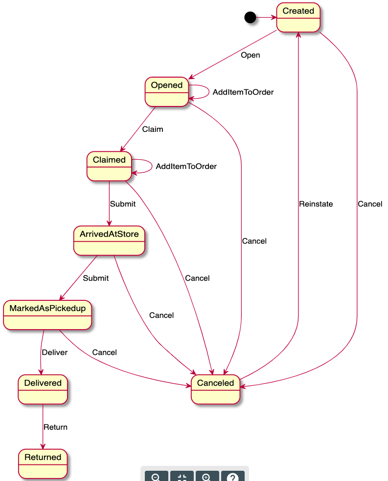

# Plinko - a Stateless State Machine for Go

The project, as well as the example below, are inspired by the [Erlang stateless State Machine](https://erlang.org/doc/design_principles/statem.html) and [Stateless project](https://github.com/dotnet-state-machine/stateless) implementations along with the [Tinder State Machine](https://github.com/Tinder/StateMachine).  The goal is to create the fastest state machine that can be reused across many entities with the least amount of overhead in the process.

## Why Stateless
Most state machine implementations keep track of an in-memory state during the running of an application. This makes sense for desktop applications or games where the journey of that state is critical to the user-facing process, but that doesn't map well to a service that is shepherding things like Orders and Products that number in the thousands-to-millions on any given day.

Stateless State Machines are simply the extraction of the state from the mechanics of state transition.  This allows the state machine to be reduced to a simple data structure, and enables the cost of wiring up the machine to happen only once.  In turn, the state machine can shared across multiple threads and executed concurrently without interference between discrete runs.

There are a number of good articles on this front, there are a couple that focus on state design from the [esoteric around soundness of the design](https://en.wikibooks.org/wiki/Haskell/Understanding_monads/State) to the more [functional programming based definition of a state machine](https://hexdocs.pm/as_fsm/readme.html).

## Common implementation pattern in web services
Many times, a web service may have controllers that span the lifecycle of the entity they are coordinating.  This pattern allows the controller to play the key, narrow role of traffic coordinator and defers execution decisions to the state machine.  The state machine introduces two key notions: State and Trigger.  Triggers are mapped to states and execution paths can be different based on states. Applying this to an MVC pattern, the entity contains the state and the state modifying `[POST|PUT|PATCH]` endpoint is the trigger.  For example:

An order can be in different states during it's lifecycle:  Open, Claimed, Delivered, etc.   If someone wishes to cancel that order, there are different protocols and processes involved in each of those states.  In this approach a `/cancel/{id}` endpoint is called.  The controller loads the order into a payload and fires the `Cancel` trigger at it using the state machine.  The state machine selects the proper flow and returns the status when complete.

## Features

* Simple support for states and triggers
* Entry/Exit events for states
* Side Effect support for supporting uniform functionality when modifying state

Some useful extensions are also provided:

* Pushes state external to the structure - instantiate once, use many times.
* Reentrant states
* Export to PlantUML

# Introspection
The state machine can provide a list of triggers for a given state to provide simple access to the list of triggers for any state.

## Creating a state machine
A state machine is created by articulating the states,  the triggers that can be used at each state and the destination state where they land. Here is a sample declaration of the states and triggers we will use:

```go
const Created          State = "Created"
const Opened           State = "Opened"
const Claimed          State = "Claimed"
const ArriveAtStore    State = "ArrivedAtStore"
const MarkedAsPickedUp State = "MarkedAsPickedup"
const Delivered        State = "Delivered"
const Canceled         State = "Canceled"
const Returned         State = "Returned"

const Submit    Trigger = "Submit"
const Cancel    Trigger = "Cancel"
const Open      Trigger = "Open"
const Claim     Trigger = "Claim"
const Deliver   Trigger = "Deliver"
const Return    Trigger = "Return"
const Reinstate Trigger = "Reinstate"
```

 Below, a state machine is created describing a set of states an order can progress through along with the triggers that can be used.

```go
p := plinko.CreateDefinition()

p.Configure(Created).
	OnEntry(OnNewOrderEntry).
	Permit(Open, Opened).
	Permit(Cancel, Canceled)

p.Configure(Opened).
	Permit(AddItemToOrder, Opened).
	Permit(Claim, Claimed).
	Permit(Cancel, Canceled)

p.Configure(Claimed).
	Permit(AddItemToOrder, Claimed).
	Permit(Submit, ArriveAtStore).
	Permit(Cancel, Canceled)

p.Configure(ArriveAtStore).
	Permit(Submit, MarkedAsPickedUp).
	Permit(Cancel, Canceled)

p.Configure(MarkedAsPickedUp).
	Permit(Deliver, Delivered).
	Permit(Cancel, Canceled)

p.Configure(Delivered).
	Permit(Return, Returned)

p.Configure(Canceled).
	Permit(Reinstate, Created)
	
p.Configure(Returned)
```

Once created, the next step is compiling the state machine.  This means the state machine is validated for complete-ness.  At this stage, Errors and Warnings are raised.  This incidentally allows the state machine definition to be fully testable in the build pipeline before deployment.

```go
co := p.Compile()

if co.error {
    // exit
}

fsm := co.StateMachine
```

Once we have the state machine, we can pass that around explicitly or through things like controller context to make it available where needed.

We can trigger the state processes by creating a PlinkoPayload and handing it to the statemachine like so:

```go
payload := appPayload{ /* ... */ }
fsm.Fire(appPayload, Submit)
```

## Functional Composition

When entering or exiting a state, a series of functions need to act to make that transition complete.  Some transitions are simple, and some are complex.  The key here is creating a series of steps that are testable and operate based on a standard pattern. 

Let's take a look at a piece of code we setup earlier:


```go 
p.Configure(Created).
	OnEntry(OnNewOrderEntry).
	Permit(Open, Opened).
	Permit(AddItem, Created)
```

OnNewOrderEntry is function defined as such:

``` go
func OnNewOrderEntry(p plinko.Payload, t plinko.TransitionInfo) (plinko.Payload, error) {
	// perform a series of steps based on the 
	// payload and transition info
	// ...

	return p, nil
}
```

This is useful for a couple of reasons: First, this becomes one distinct action that can succeed or fail.  When it succeeds, the chain continues and works toward the successful transition to the new state. And second, this is an operation that can be tested in isolation.  

Both of these reasons are significant when building a complex set of transitions.

Next, we have a variation on the chaining where we can say "only run this function if a particular trigger triggered the transition".   This is the `OnTriggerEntry(trigger, func)` function.

```go 
p.Configure(Created).
	OnTriggerEntry(AddItem, RecalculateTotals).
	Permit(Open, Opened).
	Permit(AddItem, Created)
```

 In the example above, the `RecalculateTotals` function is only executed when the `AddItem` trigger is raised.   This allows us to explicitly describe the transition steps without placing that complexity inside the `RecalculateTotals` function.


## Side-Effect Support

Side-Effect supports wiring up common functions that respond to state changes happening.   This is a great place for logging and recording movement in a uniform way.

Side Effects are raised at different phases of a state transition.  Given an order that's sitting in a `Created` state that has been actioned with an `Open` trigger, we'll see the following calls to the SideEffect functions.

| State | Action |  Trigger | Destination State |
| --- | --- | --- | --- |
| Created | BeforeStateExit | Open | Opened |
| Created | AfterStateExit | Open | Opened |
| Created | BeforeStateEntry | Open | Opened |
| Created | AfterStateEntry | Open | Opened |

In the above list, you can see the registered function is called 4 times throughout the lifecycle of the transition.   This gives us consistency and observability throughout the process.

We can better understand how this works by looking at a standard configuration.  

```go
// given a standard definition ...
p := plinko.CreateDefinition()

p.Configure(Created).
	OnEntry(OnNewOrderEntry).
	Permit(Open, Opened).
	Permit(Cancel, Canceled)

p.Configure(Opened).
	Permit(AddItemToOrder, Opened).
	Permit(Claim, Claimed).
	Permit(Cancel, Canceled)


// we register for side effects like this.
p.SideEffect(StateLogging)
p.SideEffect(MetricsRecording)
p.FilteredSideEffect(AfterStateEntry, StateEntryRecording)
```

In the case above, we registered two functions that get executed whenever a change happens.  These functions will always be called in the order they are registered for a given state transition.

In addition, we registered a FilteredSideEffect that only gets called on the requested action.

These are functions that have signature including the starting state, the destination state, the trigger used to kick off the transition and the payload.

```go
func StateLogging(action StateAction, payload Payload, transitionInfo TransitionInfo) {
	// this can typically be broken out into a function on the logger, but keeping
	// it here for clarity in demonstration

	logEntry := StateLog {
		Action:           action,
		SourceState:      transitionInfo.GetSource(),
		DestinationState: transitionInfo.GetDestination(),
		Trigger:          transitionInfo.GetTrigger(),
		OrderID:          payload.GetOrderID(),
	}

	// call to our logger that will decorate the entry with timing information and the like.
	logger.LogStateInfo(logEntry)
}

func MetricsRecording(action StateAction, payload Payload, transitionInfo TransitionInfo) {
	// this can be a simple function that pulls apart the details and sends them to
	// things like graphite, influx or any timeseries metrics database for graphing and alerting.
	metrics.RecordStateMovement(action, payload, transitionInfo)
}

```


## State Machine documentation
The fsm can document itself upon a successful compile - emitting PlantUML which can, in turn, be rendered into a state diagram:

```go
uml, err := p.RenderUml()

if err != nil {
    // exit...
}

fmt.Println(string(uml))
```



